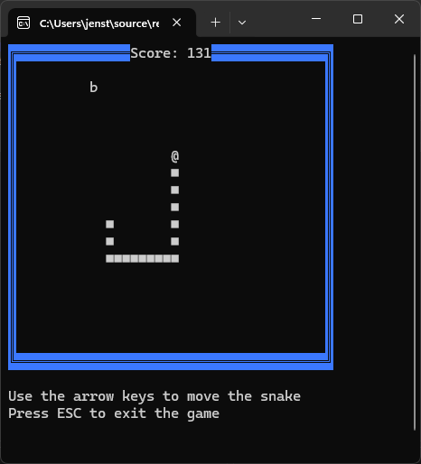
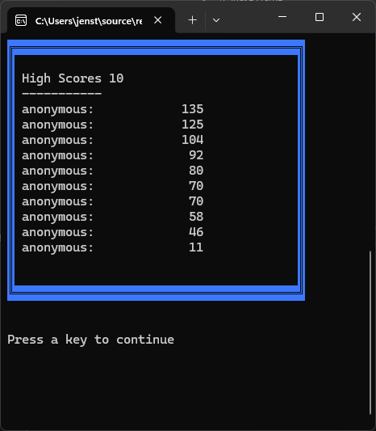

[![Contributors][contributors-shield]][contributors-url]
[![Forks][forks-shield]][forks-url]
[![Stargazers][stars-shield]][stars-url]
[![Issues][issues-shield]][issues-url]
[![MIT License][license-shield]][license-url]
[![LinkedIn][linkedin-shield]][linkedin-url]

<br />
<div align="center">
    <a href="https://github.com/TirsvadCLI/CSharp.Game.Snake">
        
    </a>
    <h3 align="center">Snake Game</h3>
    <p align="center">
    A classic snake game for windows console and linux console
    <br />
    <br />
    <!-- PROJECT SCREENSHOTS -->
    <a href="https://github.com/TirsvadCLI/CSharp.Game.Snake/blob/master/images/Screenshot_menu.png">
        
    </a>
    <a href="https://github.com/TirsvadCLI/CSharp.Game.Snake/blob/master/images/Screenshot_snakeGame.png">
        
    </a>
    <a href="https://github.com/TirsvadCLI/CSharp.Game.Snake/blob/master/images/Screenshot_highscore.png">
        
    </a>
    <br />
    <a href="https://github.com/TirsvadCLI/CSharp.Game.Snake"><strong>Explore the docs »</strong></a>
    <br />
    <br />
    <a href="https://github.com/TirsvadCLI/CSharp.Game.Snake/issues/new?labels=bug&template=bug-report---.md">Report Bug</a>
    ·
    <a href="https://github.com/TirsvadCLI/CSharp.Game.Snake/issues/new?labels=enhancement&template=feature-request---.md">Request Feature</a>
    </p>
</div>

# Snake Game
This is a simple snake game for windows console and linux console. It's written in C# and uses .NET 9

## Table of Contents

- [About The Snake Game](#about-the-snake-game)
- [Getting Started](#getting-started)
  * [Prerequisites](#prerequisites)
    + [Optional for changing the code](#optional-for-changing-the-code)
  * [Build and Run](#build-and-run)
    + [Powershell](#powershell)
    + [Bash (Linux)](#bash--linux-)
- [Features](#features)
- [Roadmap](#roadmap)
- [Change Log](#change-log)
- [Folder Structure](#folder-structure)

## About The Snake Game

This is a simple snake game for windows console and linux console. It's written in C# and uses .NET 9

Snake eat food and grow. The game is over if the snake hits the wall or itself.

Food gives points.

- Food 🍎 gives 10 points.
- Food 🍌 gives 11 points.
- Food 🍒 gives 12 points.

Food is placed randomly on the board. Food size is more than one field so you have to cath the left side of the food to eat it.

The snake can move up, down, left and right.

The score is shown in the top.

## Getting Started

To get a local copy up and running follow these simple steps.

### Prerequisites

This is an example of how to list things you need to use the software and how to install them.

- .NET 9.0
    ```
    https://dotnet.microsoft.com/download/dotnet/9.0
    ```

#### Optional for changing the code

- Visual Studio 2022
    ```
    https://visualstudio.microsoft.com/
    ```

#### Powershell

1. Open a powershell window and enter the following commands to download game

```powershell
# Define the URL and the destination file path
$url = "https://github.com/TirsvadCLI/CSharp.Game.Snake/releases/download/1.1.0/Snake.zip"
$destination = "Snake.zip"
$unzipPath = "Snake"

# Download the file
Invoke-WebRequest -Uri $url -OutFile $destination

# Unzip the file
Expand-Archive -Path $destination -DestinationPath $unzipPath

# Remove the zip file
Remove-Item $destination
```

2. Go to the folder and run the game
```powershell
cd Snake
.\Snake.exe
```

#### Bash (Linux)

1. Open a bash window and enter the following commands to download game
```bash
# Define the URL and the destination file path
url="https://github.com/TirsvadCLI/CSharp.Game.Snake/releases/download/1.1.0/Snake.zip"
destination="Snake"
unzipPath="Snake"

# Download the file
wget $url --output-file=$destination

# Unzip the file
rm ${destination}
unzip $destination -d $unzipPath

# Remove the zip file
rm ${destination}.zip
```

2. Go to the folder and run the game
```bash
cd Snake
./Snake.exe
```

## Features

- [x] Windows console support
- [x] Linux console support
- [x] Score system
- [x] Save and load highscore
 
## Roadmap

- [ ] Add more food types
- [ ] Add bad food which reduce score (time limited witch it change food type)
- [ ] Speed up game when snake eat food
- [ ] World highscore online
- [ ] Multi language support

## Change Log

Version 1.1.0
- Add Frame for HighScore Board
- Add Frame for input name for new HighScore
- Add menu for new game, highscore and exit
Version 1.0.0
- Add game over Board
- Add highScore Board

## Folder Structure

```
CSharp.Game.Snake/          # Root folder that contains the solution
|---Snake/                  # Contains the project
      |---Model/            # Contains the models
|---images/                 # Contains images
|---logo/                   # Contains the logo
```

<!-- MARKDOWN LINKS & IMAGES -->
[contributors-shield]: https://img.shields.io/github/contributors/TirsvadCLI/CSharp.Game.Snake?style=for-the-badge
[contributors-url]: https://github.com/TirsvadCLI/CSharp.Game.Snake/graphs/contributors
[forks-shield]: https://img.shields.io/github/forks/TirsvadCLI/CSharp.Game.Snake?style=for-the-badge
[forks-url]: https://github.com/TirsvadCLI/CSharp.Game.Snake/network/members
[stars-shield]: https://img.shields.io/github/stars/TirsvadCLI/CSharp.Game.Snake?style=for-the-badge
[stars-url]: https://github.com/TirsvadCLI/CSharp.Game.Snake/stargazers
[issues-shield]: https://img.shields.io/github/issues/TirsvadCLI/CSharp.Game.Snake?style=for-the-badge
[issues-url]: https://github.com/TirsvadCLI/CSharp.Game.Snake/issues
[license-shield]: https://img.shields.io/github/license/TirsvadCLI/CSharp.Game.Snake?style=for-the-badge
[license-url]: https://github.com/TirsvadCLI/CSharp.Game.Snake/blob/master/LICENSE
[linkedin-shield]: https://img.shields.io/badge/-LinkedIn-black.svg?style=for-the-badge&logo=linkedin&colorB=555
[linkedin-url]: https://www.linkedin.com/in/jens-tirsvad-nielsen-13b795b9/
